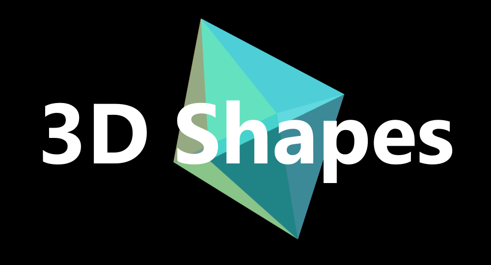

<!-- Page Title -->
<h1 align="center">3D Shapes</h1>  

<!-- Title Image -->

  

<!-- Game Description -->

  <b>CSS Animated 3D Shapes</b>

  Playground project for mobile-responsive CSS 3D shapes and animations, as well as dynamic active links.

<!-- Links -->

  <a href="https://twit96.github.io/3D-shapes/"><b>Click to View Website!</b></a>

